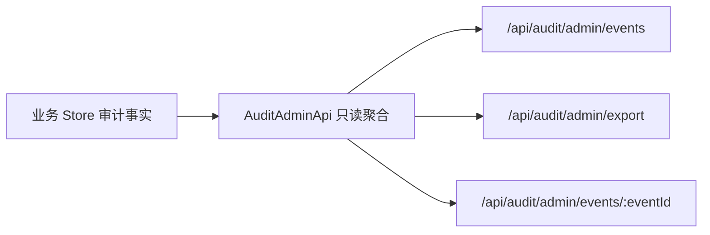

# 统一审计 Store 架构方案

## 背景

M9-A/M9-B 已经完成审计中心的只读聚合、CSV 导出和事件详情追踪。当前事实仍分散在课程商品审计、会员操作审计、订单操作审计、交易操作审计、咨询运营审计和风险复核记录中。这个设计是刻意保守的：各业务 Store 仍是自己领域的真相源，审计中心只负责查询投影，不参与业务状态流转。

M9-C 的目标是为长期合规审计和跨模块检索建立统一归档边界，但不在本阶段替换既有业务 Store，也不让新表成为业务状态判断来源。

## 目标

- 建立统一审计 Store 的稳定事件口径，支持跨模块筛选、导出、来源追踪和后续长期留存。
- 引入只追加 PostgreSQL 归档表草案，用幂等键支持重复归档、回填和失败重试。
- 明确隐私最小化白名单，统一归档只保存运营审计摘要，不保存咨询、测评、风险和支付的敏感原文。
- 保持现有业务 Store 和审计中心 API 向前兼容，M9-C 只新增契约、迁移草案、文档和 schema 测试。

## 非目标

- 不把课程商品、订单、交易、咨询或风险模块的业务状态切换到统一审计表。
- 不用归档表驱动支付、退款、预约、风险复核等状态机。
- 不删除或合并既有业务审计表。
- 不保存咨询说明全文、测评答案原文、风险信号原文、支付回调完整 payload 或渠道敏感字段。
- 不在本阶段实现后台定时任务、队列、双写中间件或读取切换开关。

## 为什么不直接替换业务 Store

现有后台已经形成多个领域状态机：课程商品审核、订单关闭/异常、退款受理、咨询履约、风险 SOP 处理都由各自 server service 决策。它们的审计表不仅用于审计，也承载领域内的排障上下文，例如退款渠道受理摘要、咨询运营策略快照、风险 SOP 模板版本。统一审计 Store 如果过早成为真相源，会带来三类风险：

- 领域语义丢失：统一事件只能表达跨模块公共字段，无法完整替代各业务模块的专用字段。
- 迁移风险放大：一旦写动作直接切到统一 Store，订单、退款、咨询和风险复核的回滚路径会变长。
- 隐私边界变宽：业务表中可能存在更细的排障数据，统一归档必须先证明只保留摘要字段。

因此统一审计 Store 的第一阶段只做归档投影。业务 Store 继续是事实来源，归档表只用于长期查询、导出性能优化和合规留存。

## 事件契约

`shared/domain/auditCenter.ts` 新增 `AuditCenterArchiveEventSchema`，保持现有 `AuditCenterEventSchema`、导出和详情契约不变。

归档事件包含：

- `id`：审计中心稳定事件 ID，与当前列表/详情使用的归一化 ID 对齐。
- `idempotencyKey`：幂等归档键，建议使用 `module:sourceEventId`，同一源事件重复归档只更新/忽略同一行。
- `source`：来源描述，包括来源模块、源事件 ID、来源 Store、来源表、来源记录 ID 和源发生时间。
- `module`、`action`、`resource`、`actor`、`reason`、`summary`：跨模块公共审计字段。
- `beforeSummary`、`afterSummary`：隐私最小化后的前后状态摘要对象。
- `occurredAt`、`archivedAt`：业务事件发生时间和归档时间。
- `schemaVersion`、`policyVersion`、`privacyLevel`：事件结构版本、隐私口径版本和摘要级归档标识。
- `backfillBatchId`：批量回填时的批次追踪。

## PostgreSQL 归档表草案

新增迁移草案 `server/db/migrations/0015_audit_center_archive.sql`，只创建 `audit_center_archived_events` 和索引：

| 字段                                             | 说明                      |
| ------------------------------------------------ | ------------------------- |
| `id`                                             | 稳定审计事件 ID           |
| `idempotency_key`                                | 唯一幂等键                |
| `source_module`                                  | 来源业务模块              |
| `source_event_id`                                | 来源模块原始审计事件 ID   |
| `source_store`                                   | 来源 Store 名称           |
| `source_table`                                   | PostgreSQL 来源表，可为空 |
| `source_record_id`                               | 来源记录 ID，可为空       |
| `module`                                         | 审计中心模块              |
| `action`                                         | 稳定动作值                |
| `resource_type`、`resource_id`、`resource_label` | 资源定位摘要              |
| `actor_id`、`actor_roles`                        | 操作者和角色              |
| `reason`                                         | 操作原因摘要              |
| `summary`                                        | 事件摘要                  |
| `before_summary`、`after_summary`                | 前后状态摘要 JSONB        |
| `occurred_at`、`archived_at`                     | 发生时间和归档时间        |
| `schema_version`、`policy_version`               | 结构版本和隐私口径版本    |
| `privacy_level`                                  | 固定为 `summary_only`     |
| `backfill_batch_id`                              | 回填批次                  |

索引策略：

- `uniq_audit_center_archived_events_idempotency_key`：保障重复归档和重试幂等。
- `idx_audit_center_archived_events_module_occurred_at`：模块 + 时间列表。
- `idx_audit_center_archived_events_action_occurred_at`：动作筛选。
- `idx_audit_center_archived_events_resource`：资源定位和详情追踪。
- `idx_audit_center_archived_events_actor_occurred_at`：操作者追溯。
- `idx_audit_center_archived_events_source`：来源模块和源事件定位。
- `idx_audit_center_archived_events_archived_at`：归档批次排查和留存任务。

## 隐私白名单

统一归档只允许保存以下摘要字段：

- 资源类型、资源 ID、资源展示名或短摘要。
- 操作者 ID、角色集合。
- 操作动作、原因摘要、事件摘要。
- 业务状态、审核状态、金额分、渠道枚举、SOP 模板 ID/版本、异常等级等结构化摘要。
- before/after 中经过领域服务裁剪后的状态摘要。

统一归档明确禁止保存：

- 咨询前说明全文、咨询记录、咨询师临床笔记和服务过程细节。
- 测评答案原文、题目逐题响应、报告解释长文本。
- 风险信号原文、危机描述原文、人工联系记录全文。
- 支付回调原始 payload、签名、银行卡、实名信息、渠道敏感交易扩展字段。
- 用户手机号明文、身份证件、资质原件、合同文件、发票抬头敏感原文。

## 数据流

当前 M9-A/M9-B：

M9-D 建议切片：

M9-D 不建议先做业务双写。更稳妥的切片是先做一个可手动触发或服务端函数调用的归档任务：读取现有聚合结果，映射为 `AuditCenterArchiveEventSchema`，按 `idempotency_key` 幂等写入归档表。这样失败时只需要清理或重跑归档，不会影响订单、支付、咨询或风险处理。

## 回填策略

1. 使用归档批次 ID 标记每次回填，例如 `audit_backfill_20260515_001`。
2. 按模块和发生时间窗口分页读取现有聚合事件。
3. 对每条事件生成稳定 `id` 和 `idempotency_key`。
4. 通过唯一幂等键执行 upsert 或冲突忽略。
5. 记录归档数量、跳过数量和错误摘要，错误只保留来源 ID 和失败原因，不保留敏感 payload。

如果某个来源模块的历史事件缺失字段，归档任务应跳过该事件并记录 `source_module + source_event_id`，不能用不完整数据伪造事实。

## 失败恢复

- 归档任务可重复执行，幂等键保证不会重复插入。
- 单条事件失败不阻塞整个批次，批次结束后输出失败摘要。
- 归档表不参与业务状态判断，回滚时可以暂停归档任务或删除指定 `backfill_batch_id` 的试验数据。
- 事件口径版本升级时新增 `schema_version` 或 `policy_version`，不要重写历史敏感字段。

## M9-D 最小实现切片

建议下一步做“审计归档任务与只读校验试点”，范围控制为：

- 新增 `server/modules/audit/auditArchiveStore.ts` 接口，定义 `upsertArchivedEvents`、`listArchivedEvents`、`countArchivedEvents`。
- 新增 PostgreSQL 实现，写入 `audit_center_archived_events`，只接受已经通过 `AuditCenterArchiveEventSchema` 校验的摘要事件。
- 新增归档映射函数，把现有 `AuditCenterEventSchema` 加来源描述转换为 `AuditCenterArchiveEventSchema`。
- 新增手动 service 函数或受控后台 API，按模块和时间窗口归档当前聚合事件；默认不自动运行。
- 新增测试覆盖幂等写入、隐私字段裁剪、批次失败摘要和不影响现有 `/api/audit/admin/events`。

这个切片足够小，可测试、可回滚，也不会把归档表提前变成业务真相源。读取切换、定时任务、队列和告警可以放到 M9-E/M10。
