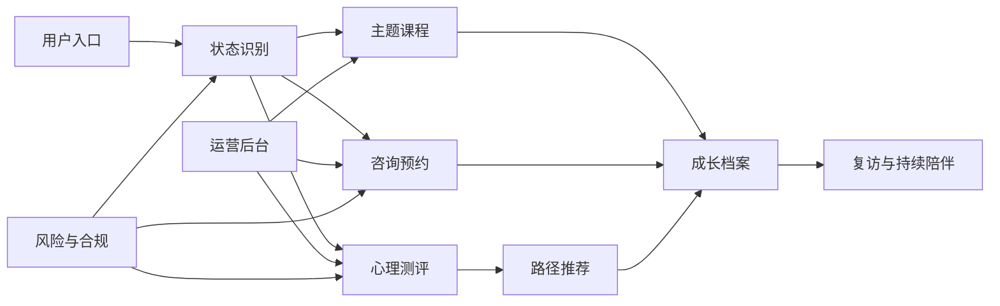

# 红博士心理小讲堂产品工程路线

## 业务定位

红博士不是单纯的课程货架，而是面向心理困扰与个人成长的陪伴式服务平台。它需要把“先理解状态、再给出路径、过程中持续支持”做成主线：用户进入后可以描述或选择当前困扰，完成轻量测评，获得课程、咨询或自助练习建议，并在后续形成个人成长档案。

平台的核心体验应当围绕三类用户展开：

- 来访者：需要安全、私密、低压力地获得支持，典型需求包括情绪低落、睡眠焦虑、亲密关系、亲子沟通、职场耗竭和自我怀疑。
- 咨询师与内容专家：需要维护资质、排班、服务记录和课程内容，并获得可控的用户转介。
- 运营人员：需要配置课程、测评、推荐规则、咨询师服务、订单、优惠、会员和风险审核流程。

## 能力地图

## 业务域拆分

| 业务域     | 第一阶段目标                                | 后续扩展                                 |
| ---------- | ------------------------------------------- | ---------------------------------------- |
| 用户与认证 | 手机/微信登录、用户资料、协议同意、会员身份 | 家庭账号、未成年人监护人验证、咨询师账号 |
| 课程       | 课程列表、分类筛选、详情、收藏、学习进度    | 章节、作业、直播回放、证书、内容审核     |
| 心理测评   | 轻量状态评估、维度评分、风险分级、推荐结果  | 标准量表授权管理、多版本题库、报告解释   |
| 咨询预约   | 咨询师列表、服务档案、时段、预约单          | 支付、改期、取消、咨询记录、督导流程     |
| 订单与会员 | 课程/咨询/会员订单、支付状态、优惠          | 退款、发票、分销、套餐、企业账户         |
| 推荐       | 根据困扰、测评和行为推荐课程/咨询           | 规则引擎、A/B 测试、个性化排序           |
| 运营后台   | 内容、咨询师、订单、用户、风险事件管理      | 数据看板、权限分级、批量导入、审批流     |
| 风险与审计 | 风险事件、人工复核、操作日志                | 危机干预 SOP、敏感词策略、合规模板       |

## 工程阶段

### M1: 工程基础与领域契约

- 建立 `shared/domain` 作为前后端共享的业务类型与 Zod 校验契约。
- 保留现有 mock 页面，同时让 mock 数据通过共享契约验证。
- 建立产品工程文档，明确业务边界、数据模型和模块演进方式。
- CI 持续执行 `check`、`test`、`build`。

验收标准：

- 所有新增业务模型有类型定义和运行时校验。
- 当前 mock 数据可被课程契约验证。
- 后续 API 和数据库表可以直接按契约落地。

### M2: 课程中心产品化

- 将课程列表、筛选、排序、收藏、详情页拆为 `features/courses`。
- 引入 API adapter，保留 mock adapter 作为本地 fallback。
- 提供开发期和生产期一致的 `GET /api/courses` 课程接口，并支持筛选、排序、搜索与分页查询参数。
- 完成课程详情、章节、学习进度、收藏列表。
- 建立课程权益 API adapter，覆盖免费、已购、会员可学和待购买状态。
- 建立课程权益 Store 接口，用本地 JSON 文件持久化开发期订单/会员状态，并按用户 ID 隔离。
- 为筛选、分页、收藏、价格展示补单元测试。

验收标准：

- 前端不直接依赖裸 mock 数据。
- 课程功能可切换 mock/API 数据源。
- 用户动作有明确 loading、empty、error 状态。
- 课程权益状态刷新后仍可恢复，并可平滑替换为数据库实现。

### M3: 用户系统与会员体系

- 建立 `/api/auth/session`、手机号登录和微信登录的会话 API，前端通过 auth adapter 同步服务端会话。
- 登录时生成 terms/privacy 协议记录，并随 session 返回。
- 接入真实短信/微信服务、资料页、协议同意持久化。
- 建立 RBAC：visitor、member、counselor、operator、admin。
- 补充会员权益、订单关联和内容访问控制。
- 建立 `/me/courses` 个人学习工作台，聚合课程权益、学习进度、收藏、会员状态和订单记录。
- 将 `/me/courses` 扩展为个人成长空间，接入最近测评报告和咨询预约记录。
- 建立 `GET /api/growth/profile` 成长档案聚合接口，统一输出课程权益、订单、最新测评、咨询预约和时间线。
- 课程购买和会员开通接入 `member` 权限守卫；后续扩展 operator/admin 后台权限。
- 将当前开发期登录实现替换为真实会话鉴权中间件，并逐步移除读取场景里的 `x-hongboshi-user-id` 兜底。

验收标准：

- 所有需要身份的操作统一走权限守卫。
- 前端状态和服务端会话一致。
- 用户协议版本可追踪。

### M4: 心理测评与推荐路径

- 建立测评题库、答题流程、报告生成和推荐规则。
- 建立 `/assessment` 快速评估入口，输出维度分、风险等级、课程推荐和咨询建议。
- 快速测评 API 同时支持开发 Vite 中间件和生产 Express 服务。
- 在首页“选择当前状态”后串联测评、课程和咨询预约。
- 对高风险回答生成风险事件，并进入人工复核。

验收标准：

- 测评报告包含维度分、摘要、推荐理由和风险等级。
- 推荐结果可解释、可运营配置。
- 高风险路径不会直接进入普通营销链路。

### M5: 咨询预约闭环

- 咨询师档案、资质摘要、擅长方向、排班时段。
- `/consulting` 咨询预约入口，支持选择咨询师、时段、困扰标签、紧急程度和咨询前说明。
- `GET /api/counseling/availability` 和 `POST /api/counseling/appointments`，同时支持 Vite 开发中间件和生产 Express 服务。
- 用户预约生成待支付预约单，并锁定咨询时段；高风险/危机诉求生成风险事件。
- `GET /api/counseling/appointments` 在成长空间展示当前用户的最近预约记录。
- 接入预约状态机：确认支付后进入已预约，取消预约后释放时段。
- 接入待支付预约超时释放：30 分钟未支付会自动取消预约并释放时段，成长档案与可用时段读取都会先刷新过期锁定。
- 接入咨询预约订单绑定：预约创建时生成 `counseling_session` 待支付订单，确认支付后订单进入已支付并驱动预约确认，待支付取消/超时会关闭订单。
- 接入支付回调抽象：`payment.succeeded` 事件会校验订单、金额和渠道，并驱动咨询预约确认；当前确认支付按钮走模拟回调，后续可替换为微信/支付宝真实回调。
- 后续接入支付签名校验、改期和退款状态流转。
- 后续建立咨询师工作台、咨询记录和运营端风险复核。

验收标准：

- 当前阶段：用户可以完成从测评推荐或首页进入咨询预约，并生成预约单。
- 下一阶段：支付签名校验、改期、取消退款有明确状态机。
- 用户与咨询师看到一致的预约状态，关键操作进入审计日志。

### M6: 后台与运营增长

- 建立内容、用户、订单、咨询师、测评和风险后台。
- 增加运营位、优惠券、会员配置、数据看板。
- 建立可观测性：请求日志、错误追踪、关键业务指标。

验收标准：

- 运营可独立配置常规内容与推荐规则。
- 敏感操作可追溯。
- 关键漏斗指标可观察。

## 推荐技术演进

- 前端：继续使用 Vite + React + TypeScript；按 `features / entities / shared` 分层拆分业务。
- API：先用 Express 模块化承接，稳定后可迁移到更完整的服务框架。
- 数据库：PostgreSQL，配合 Prisma 或 Drizzle 管理 schema 与 migration。
- 持久化：各业务模块先暴露 Store/repository 接口，API 只依赖接口，数据库实现负责事务、锁和审计。
- 数据建模：以 `server/db/schema.ts` 和初始 SQL 迁移作为基准，先锁定核心表和索引，再选择 ORM。
- 缓存与队列：Redis 用于验证码、预约时段锁、限流和后台异步任务。
- 契约：共享 Zod schema 作为请求/响应校验，避免前后端类型漂移。
- 测试：领域 schema 单测、前端交互测试、后端 API 集成测试、关键流程端到端测试。

## 维护原则

- 业务模块先按领域拆分，避免页面组件直接承载业务规则。
- 所有跨端数据结构先进入 `shared/domain`，再被 client 和 server 消费。
- 页面只负责交互呈现，筛选、推荐、权限、状态流转下沉到 feature service 或 server service。
- 对心理测评、咨询预约、订单和风险事件使用显式状态机，禁止散落的字符串判断。
- 涉及个人信息、未成年人、风险提示和咨询记录的能力默认要有权限、审计和最小化采集设计。
