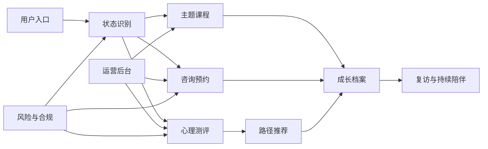

# 红博士心理小讲堂产品工程路线

## 业务定位

红博士不是单纯的课程货架，而是面向心理困扰与个人成长的陪伴式服务平台。它需要把“先理解状态、再给出路径、过程中持续支持”做成主线：用户进入后可以描述或选择当前困扰，完成轻量测评，获得课程、咨询或自助练习建议，并在后续形成个人成长档案。

平台的核心体验应当围绕三类用户展开：

- 来访者：需要安全、私密、低压力地获得支持，典型需求包括情绪低落、睡眠焦虑、亲密关系、亲子沟通、职场耗竭和自我怀疑。
- 咨询师与内容专家：需要维护资质、排班、服务记录和课程内容，并获得可控的用户转介。
- 运营人员：需要配置课程、测评、推荐规则、咨询师服务、订单、优惠、会员和风险审核流程。

## 能力地图

## 业务域拆分

| 业务域     | 第一阶段目标                                | 后续扩展                                 |
| ---------- | ------------------------------------------- | ---------------------------------------- |
| 用户与认证 | 手机/微信登录、用户资料、协议同意、会员身份 | 家庭账号、未成年人监护人验证、咨询师账号 |
| 课程       | 课程列表、分类筛选、详情、收藏、学习进度    | 章节、作业、直播回放、证书、内容审核     |
| 心理测评   | 轻量状态评估、维度评分、风险分级、推荐结果  | 标准量表授权管理、多版本题库、报告解释   |
| 咨询预约   | 咨询师列表、服务档案、时段、预约单          | 支付、改期、取消、咨询记录、督导流程     |
| 订单与会员 | 课程/咨询/会员订单、支付状态、优惠          | 退款、发票、财务核算、分销、企业账户     |
| 推荐       | 根据困扰、测评和行为推荐课程/咨询           | 规则引擎、A/B 测试、个性化排序           |
| 运营后台   | 内容、咨询师、订单、用户、风险事件管理      | 数据看板、权限分级、批量导入、审批流     |
| 风险与审计 | 风险事件、人工复核、操作日志                | 危机干预 SOP、敏感词策略、合规模板       |

## 工程阶段

持续二次开发的执行状态、下一步任务包和后台专项路线图由以下文档维护：

- [运营管理后台建设路线图](./admin-management-roadmap.md)
- [Codex 连续执行状态](./codex-execution-state.md)
- [Codex 连续执行协议](./codex-operating-protocol.md)
- [会员售卖状态回归与真实支付前准备](./membership-sales-readiness.md)
- [课程素材正式存储架构准备](./course-asset-storage-architecture.md)

### M1: 工程基础与领域契约

- 建立 `shared/domain` 作为前后端共享的业务类型与 Zod 校验契约。
- 保留现有 mock 页面，同时让 mock 数据通过共享契约验证。
- 建立产品工程文档，明确业务边界、数据模型和模块演进方式。
- CI 持续执行 `check`、`test`、`build`。

验收标准：

- 所有新增业务模型有类型定义和运行时校验。
- 当前 mock 数据可被课程契约验证。
- 后续 API 和数据库表可以直接按契约落地。

### M2: 课程中心产品化

- 将课程列表、筛选、排序、收藏、详情页拆为 `features/courses`。
- 引入 API adapter，保留 mock adapter 作为本地 fallback。
- 提供开发期和生产期一致的 `GET /api/courses` 课程接口，并支持筛选、排序、搜索与分页查询参数。
- 用户端已新增 `/courses` 独立课程列表页，并将首页首屏、导航和课程发现区调整为课程优先的信息架构。
- 已建立前端课程路径模型与路径转化组件，首页和课程页可按情绪稳定、关系修复、亲子连接、职场韧性和自我成长驱动课程筛选与详情跳转。
- 已完成课程电商化货架主动作、列表内半屏下单、全局待支付召回、商品信任模块、券后价展示和优惠/组合购比较区，课程路径、快速开始区和课程列表卡片均可直接开始学习、立即购买、开通会员或继续支付；课程中心、课程详情和成长空间可召回待支付订单并复用共享结算抽屉，课程详情页前置讲师、学习反馈、售后/隐私边界、FAQ、单课/会员/路径组合预览和本单优惠明细。
- 已完成课程交易界面商品化优化：首页首屏和课程中心首屏前置课程商品货架，课程卡片可直接进入详情页课程介绍区，课程详情页新增粘性锚点、图文课程亮点、内容规模/适合状态/核心收获证明点和就近购买动作；课程商品陈列逻辑进入 `features/courses` 纯模型，便于后续运营素材和个性化排序升级。
- 已完成课程详情成交素材后台化首个切片：`CourseProductDetailContentSchema` 新增 `merchandising` 成交图文内容，后台 `/admin/courses` 可维护详情成交标题、副标题、主视觉、卖点和图文资产；前台课程详情优先展示后台维护的主视觉、卖点和已审核图文资产，PostgreSQL `course_product_contents.sales_assets` 保存同一份内容。
- 已完成课程素材资产登记、真实文件上传、受控读取、学习页资料绑定和正式存储准备切片：新增课程素材资产共享契约、开发期 JSON Store、本地文件存储 adapter、对象存储 adapter 接口、PostgreSQL 素材 Store、回填 dry-run/受控写入 service、素材治理只读 service、单素材治理动作 service、治理历史/批量草稿预览 service、批量治理任务草案/审批/执行只读预案/受控执行状态机/执行历史筛选 service、批量治理任务 PostgreSQL Store、执行 job 契约、最小队列接口、执行锁、失败安全重试边界、队列观测 service 和学习资料运营报表，后台素材读取/URL 登记/文件上传/合规处理 API 和 `/admin/courses` 素材资产库区；对象存储 provider 已支持 `local/s3/oss/cos` 配置边界、短期签名读取 URL、bucket/region/公开域名/签名密钥配置和 provider 级测试；素材治理 API 可识别未引用、重复 hash、待审/驳回、下载关闭、软删候选和引用来源，治理面板可记录处理、标记重复主素材、软删除确认、筛选治理历史、查看批量处理草稿、保存待审批批量草案、审批/驳回、为已审批任务生成只读执行预案并在确认后执行记录处理，也可按审批/执行状态、操作者、问题、动作和日期筛选任务历史并重新打开执行详情；草案第一版只记录并执行 `acknowledge_issue` 处理计划，审批和执行前都会校验候选漂移，执行前会抢占执行锁，失败任务保存最近失败原因并可安全重试，已完成任务幂等回放，同一任务并发执行会被拒绝；队列观测可查看最近 job、执行中、失败和可重试压力，学习资料报表可查看章节资料槽位绑定率、资料类型、合规、下载、引用来源和治理问题分布；执行只写批量 `asset_governance` 审计和任务执行结果，不批量修改素材、不合并引用、不软删和不物理删除对象；已通过图片可作为课程详情展示素材，已通过且开启下载且未软删除的章节资料、练习表、音频和视频可绑定到章节素材占位，学习页只对已解锁用户展示受控下载入口；素材对象表、元数据表、引用表、批量任务表、候选快照表、执行明细表、执行审计事件表、执行重试字段和索引已进入迁移草案，下一步进入批量软删与引用合并只读预案。
- 完成课程详情、章节、学习进度、收藏列表。
- 建立课程权益 API adapter，覆盖免费、已购、会员可学和待购买状态。
- 建立课程权益 Store 接口，用本地 JSON 文件持久化开发期订单/会员状态，并按用户 ID 隔离。
- 建立课程学习记录服务端同步边界，登录且已解锁课程的用户可同步章节进度、练习记录、课程完成快照和阶段证明预览准备字段；网络失败时前端保留本地 fallback。
- 建立用户偏好 Store 和 `/api/user-preferences/me`，登录后收藏课程会同步到账号；未登录仍保留本地收藏 fallback，服务端记录收藏来源和更新时间。
- 建立账号券包领取与使用状态，个人中心优惠页可领取课程券并展示已领取、已使用和关联订单；课程结算抽屉会展示当前课程已领取可用券和未领取但可用券，支持就地领取并自动选中，订单记录 claim ID / marketing rule ID，支付成功后券包核销到 `used`，成功态和个人中心可按订单 ID 深链打开订单详情抽屉。订单详情展示金额明细、支付方式、用券信息、权益交付、时间线和售后说明，待支付可继续支付/取消，已支付可回到课程或成长空间；已支付/退款中订单可提交受控售后申请，后台订单台和交易台读取售后摘要并把待处理售后纳入交易异常提示。运营可在订单台或交易台将售后工单标记处理中、解决、关闭，或在符合交易安全条件时联动发起退款申请；渠道受理后订单只进入 `refunding`，个人中心展示运营备注和退款受理提示。课程 `refund.succeeded` 回调已可把课程订单推进到 `refunded`，并自动收尾关联售后工单、写入退款完成站内通知；站内消息中心承接售后处理、退款受理、渠道暂未受理和退款已完成通知，顶部消息入口、个人中心消息 tab 和订单详情售后进度复用同一套账号级通知。金额计算仍复用服务端营销规则，售后申请和用户端展示都不会直接改写退款完成状态。
- 完成课程与会员退款后的权益回收和访问边界：单课订单进入 `refunded` 后，仅在没有其他有效已支付同课订单时回收 `ownedCourseIds`；会员权益新增来源字段，会员 checkout 写入 `checkout_order` 来源，后台人工会员动作写入 `admin_manual` 来源，会员退款仅在当前会员来源匹配退款订单且没有其他有效会员订单覆盖时降为到期。`/admin/users` 可查看会员来源摘要，课程中心、详情页和成长空间通过权益状态自动回到购买/开通入口，个人中心已退款订单展示权益已停止或已按来源处理，并通过会员重开 intent 直达会员结算。
- 完成会员独立商品化与套餐订单化：新增共享会员商品/套餐契约和 `/membership` 会员开通页，课程中心、个人中心、成长空间、页头页脚和已退款会员订单可直接进入会员商品页或会员结算；会员 checkout 创建已改为按 `membershipProductId` / `membershipPlanId` 驱动，订单 item 直接记录会员套餐 ID，支付成功后由服务端写入会员来源，待支付会员订单也按套餐 ID 召回。
- 完成会员商品运营后台与用户端价格同步首个闭环：新增 `membership_product:read/manage` 权限、会员商品后台契约、内存/JSON Store、后台 API 和 `/admin/memberships`，运营可维护会员商品文案、套餐价格、套餐暂停/恢复并查看审计记录；用户端 `/membership`、课程结算抽屉和成长空间会员结算摘要优先读取 `GET /api/memberships/product` 公共快照，服务端会员 checkout 从同一 Store 读取套餐价格并拒绝已暂停套餐的新订单；会员商品不可售时前台会阻断新单并提示“暂不可购买”，历史待支付会员订单继续按订单记录金额支付，后台会员商品页提供前台快照预览和 `/membership` 链接复制提示；会员售卖状态回归已覆盖后台改价、暂停、恢复售卖、公共快照、新订单金额和历史待支付金额。
- 为筛选、分页、收藏、价格展示补单元测试。

验收标准：

- 前端不直接依赖裸 mock 数据。
- 课程功能可切换 mock/API 数据源。
- 用户动作有明确 loading、empty、error 状态。
- 课程权益状态刷新后仍可恢复，并可平滑替换为数据库实现。
- 学习记录由服务端校验课程权益和章节归属后写入，阶段证明第一版只生成预览，不签发正式证书编号。

### M3: 用户系统与会员体系

- 建立 `/api/auth/session`、手机号登录和微信登录的会话 API，前端通过 auth adapter 同步服务端会话。
- 登录时生成 terms/privacy 协议记录，并随 session 返回。
- 接入真实短信/微信服务、资料页、协议同意持久化。
- 建立 RBAC：visitor、member、counselor、operator、admin。
- 补充会员权益、订单关联和内容访问控制。
- 建立 `/me/courses` 个人学习工作台，聚合课程权益、学习进度、收藏、会员状态和订单记录。
- 将 `/me/courses` 扩展为个人成长空间，接入最近测评报告和咨询预约记录。
- 建立 `GET /api/growth/profile` 成长档案聚合接口，统一输出课程权益、订单、最新测评、咨询预约和时间线。
- 课程购买和会员开通接入 `member` 权限守卫；后续扩展 operator/admin 后台权限。
- 将当前开发期登录实现替换为真实会话鉴权中间件，并逐步移除读取场景里的 `x-hongboshi-user-id` 兜底。
- 已接入 `/admin/users` 用户会员只读后台，使用 `user:read` 权限聚合账号、会员、课程权益、订单、咨询预约和风险摘要，并保持隐私最小化。

验收标准：

- 所有需要身份的操作统一走权限守卫。
- 前端状态和服务端会话一致。
- 用户协议版本可追踪。

### M4: 心理测评与推荐路径

- 建立测评题库、答题流程、报告生成和推荐规则。
- 建立 `/assessment` 快速评估入口，输出维度分、风险等级、课程推荐和咨询建议。
- 快速测评 API 同时支持开发 Vite 中间件和生产 Express 服务。
- 在首页“选择当前状态”后串联测评、课程和咨询预约。
- 对高风险回答生成风险事件，并进入人工复核。

验收标准：

- 测评报告包含维度分、摘要、推荐理由和风险等级。
- 推荐结果可解释、可运营配置。
- 高风险路径不会直接进入普通营销链路。

### M5: 咨询预约闭环

- 咨询师档案、资质摘要、擅长方向、排班时段。
- `/consulting` 咨询预约入口，支持选择咨询师、时段、困扰标签、紧急程度和咨询前说明。
- `GET /api/counseling/availability` 和 `POST /api/counseling/appointments`，同时支持 Vite 开发中间件和生产 Express 服务。
- 用户预约生成待支付预约单，并锁定咨询时段；高风险/危机诉求生成风险事件。
- `GET /api/counseling/appointments` 在成长空间展示当前用户的最近预约记录。
- 接入预约状态机：确认支付后进入已预约，取消预约后释放时段。
- 接入待支付预约超时释放：30 分钟未支付会自动取消预约并释放时段，成长档案与可用时段读取都会先刷新过期锁定。
- 接入咨询预约订单绑定：预约创建时生成 `counseling_session` 待支付订单，确认支付后订单进入已支付并驱动预约确认，待支付取消/超时会关闭订单。
- 接入支付回调抽象：`payment.succeeded` 事件会校验订单、金额和渠道，并驱动咨询预约确认；当前确认支付按钮走模拟回调，后续可替换为微信/支付宝真实回调。
- 接入支付回调可靠性基建：支持 HMAC 签名校验、5 分钟时间窗、防重复事件收据和 PostgreSQL 幂等表，生产配置 `HONGBOSHI_PAYMENT_WEBHOOK_SECRET` 后强制验签。
- 接入改期与取消退款状态机：已确认预约支持改期到新的可用时段；待支付取消关闭订单，已支付取消进入 `refunding`，模拟退款完成后预约和订单进入 `refunded`。
- 接入退款回调与履约动作：`refund.succeeded` 事件驱动退款完成；咨询师/运营可通过履约入口标记已完成或未到访。
- 接入取消规则决策器：`DEFAULT_COUNSELING_CANCELLATION_POLICY` 统一控制待支付取消、已确认退款申请和时段释放。
- 接入 `/counselor/workbench` 咨询师工作台页面与 `GET /api/counseling/workbench/appointments`，咨询师/运营可读取分配预约、状态汇总并标记完成/未到访。
- 接入 `/admin/counseling` 咨询运营配置页面，运营/管理员可更新取消规则并查看规则变更与履约审计。
- 接入咨询运营配置/审计 Store：取消规则与履约审计可切换 PostgreSQL，服务重启后仍可追溯。
- 接入 `/api/counseling/admin/schedules` 与 `/admin/counseling` 排班区，运营/管理员可按咨询师查看未来排班和服务状态，新增可预约时段，关闭未预约时段，恢复已关闭时段；锁定或已预约时段由服务端拦截，排班动作进入咨询运营审计。
- 接入 `/api/counseling/admin/service-records` 与 `/admin/counseling` 服务记录区，运营/管理员可查看服务记录、履约异常、咨询师/状态/异常筛选和摘要指标；待支付锁定临近/过期、退款中、取消待退款、未到访、临近开始未确认等异常由服务端聚合，不暴露咨询说明、测评答案或风险信号原文。
- 接入 `/api/counseling/admin/counselors` 与 `/admin/counseling` 咨询师档案区，运营/管理员可维护咨询师展示资料、擅长方向、价格、资质摘要、资质状态、资质到期时间、接单开关和服务状态；前台可预约列表会自动排除暂停接单、资质待复核或资质过期的咨询师。
- 接入 `/admin/payments` 支付对账页面与 `GET /api/payments/admin/reconciliation`，对比支付回调收据、业务订单和咨询预约状态。
- 接入 `/admin/transactions` 交易退款台与 `GET /api/transactions/admin/transactions`，统一查看支付流水、退款流水、回调处理状态、关联订单、业务对象和异常摘要，并支持退款申请、退款渠道受理摘要、交易异常工单和操作审计。
- 接入 `/admin/finance` 财务只读台与 `GET /api/finance/admin/overview`，统一展示收入、退款、净收款、退款中金额、异常金额、渠道/业务类型分布和财务明细口径。
- 接入 `/api/finance/admin/export` 财务 CSV 导出，按当前筛选条件输出生成时间、筛选条件、汇总金额、口径版本和账期/手续费/结算/发票预留字段。
- 接入 `/api/finance/admin/rules` 财务账期与手续费规则，支持自然月账期、渠道费率、固定手续费、最低手续费、规则版本和结算预览。
- 接入 `/api/risk/admin/events`、`/api/risk/admin/sop` 与 `/admin/risk` 风险复核台，运营可查看风险事件队列、隐私最小化详情、服务端 SOP 模板、升级队列和人工处理记录。
- 风险复核处理记录、SOP 模板和升级队列已具备 PostgreSQL Store，并沉淀审计中心可消费的 actor/resource/action/before/after 投影字段。
- 接入 `/api/audit/admin/events`、`/api/audit/admin/export`、`/api/audit/admin/events/:eventId` 与 `/admin/audit` 审计中心，只读聚合课程商品、会员、订单、交易、咨询运营和风险复核既有审计事实，并支持 CSV 导出和事件来源详情。
- 完成统一审计 Store 架构方案、归档事件契约、`audit_center_archived_events` 只追加表草案、Archive Store、手动归档 API、管理员归档控制台、归档只读校验接口和归档表摘要检索预览，明确先归档回填、不替换业务 Store 真相源。
- 后续接入重复排班模板、真实支付/退款渠道、结算批次、渠道结算单、风险通知协作、审计归档读取策略和对账异常处理动作。

验收标准：

- 当前阶段：用户可以完成从测评推荐或首页进入咨询预约，咨询师可以进入工作台处理履约状态。
- 下一阶段：转化漏斗埋点、真实支付/退款渠道适配、结算批次、渠道结算单、对账异常处理动作、审计归档读取切换策略和留存告警可串联。
- 用户与咨询师看到一致的预约状态，关键操作进入审计日志。

### M6: 后台与运营增长

- 已建立统一 `/admin` 运营管理后台框架，现有咨询运营配置和支付对账已接入同一套导航、权限守卫和后台首页。
- 已接入 `/admin/courses` 课程商品列表，课程 seed 可映射为运营商品契约，并支持搜索、状态、审核流、分类、排序、分页、基础信息编辑、详情内容编辑、章节/素材占位、内容质量校验、资源级权限、上下架、改价、审计记录、JSON/PostgreSQL 持久化和前台发布联动。
- 已接入 `/admin/memberships` 会员商品后台，支持会员商品配置、套餐价格、套餐状态生命周期、资源级权限和操作审计，开发期可写入 JSON Store；用户端会员公共快照和服务端会员 checkout 已复用同一 Store，后台改价会同步影响展示与新订单金额，前台会在会员商品不可售时阻断新单并保留历史待支付订单继续支付入口。
- 已接入 `/admin/users` 用户会员后台，支持用户聚合、会员操作入口和会员权益审计。
- 已接入 `/admin/orders` 统一订单台，聚合课程、会员和咨询订单，并展示支付回调摘要、履约关联、状态时间线、待支付关闭、异常标记和操作审计。
- 已接入 `/admin/transactions` 交易退款台，聚合支付/退款流水、渠道回调状态、关联订单、业务对象和异常摘要，并提供受控退款申请、退款渠道受理摘要、交易异常工单和操作审计。
- 已接入 `/admin/finance` 财务管理台，聚合收入、退款、净收款、退款中金额、异常金额、渠道/业务类型分布和财务明细，财务口径由服务端统一计算，并支持 CSV 导出、自然月账期、渠道手续费规则和结算预览。
- 已接入 `/admin/risk` 风险复核台，聚合测评、咨询前信息和运营标记产生的风险事件，提供隐私最小化详情、服务端 SOP 模板、升级队列、处理记录和 PostgreSQL 持久化。
- 已接入 `/admin/audit` 审计中心，按模块、动作、操作者、资源关键词和日期范围只读聚合后台操作审计，并支持 CSV 导出、单条事件详情定位、手动归档、归档校验和归档检索预览；统一审计 Store 已完成归档方案、表草案、Archive Store 和手动归档 API。
- 后续继续建立结算批次、真实渠道适配、通知协作、审计归档读取策略和测评后台。
- 增加运营位、优惠券、会员配置、数据看板。
- 建立可观测性：请求日志、错误追踪、关键业务指标。

验收标准：

- 运营可独立配置常规内容与推荐规则。
- 敏感操作可追溯。
- 关键漏斗指标可观察。

## 推荐技术演进

- 前端：继续使用 Vite + React + TypeScript；按 `features / entities / shared` 分层拆分业务。
- API：先用 Express 模块化承接，稳定后可迁移到更完整的服务框架。
- 数据库：PostgreSQL，配合 Prisma 或 Drizzle 管理 schema 与 migration。
- 持久化：各业务模块先暴露 Store/repository 接口，API 只依赖接口，数据库实现负责事务、锁和审计。
- 数据建模：以 `server/db/schema.ts` 和初始 SQL 迁移作为基准，先锁定核心表和索引，再选择 ORM。
- 缓存与队列：Redis 用于验证码、预约时段锁、限流和后台异步任务。
- 契约：共享 Zod schema 作为请求/响应校验，避免前后端类型漂移。
- 测试：领域 schema 单测、前端交互测试、后端 API 集成测试、关键流程端到端测试。

## 维护原则

- 业务模块先按领域拆分，避免页面组件直接承载业务规则。
- 所有跨端数据结构先进入 `shared/domain`，再被 client 和 server 消费。
- 页面只负责交互呈现，筛选、推荐、权限、状态流转下沉到 feature service 或 server service。
- 对心理测评、咨询预约、订单和风险事件使用显式状态机，禁止散落的字符串判断。
- 涉及个人信息、未成年人、风险提示和咨询记录的能力默认要有权限、审计和最小化采集设计。
